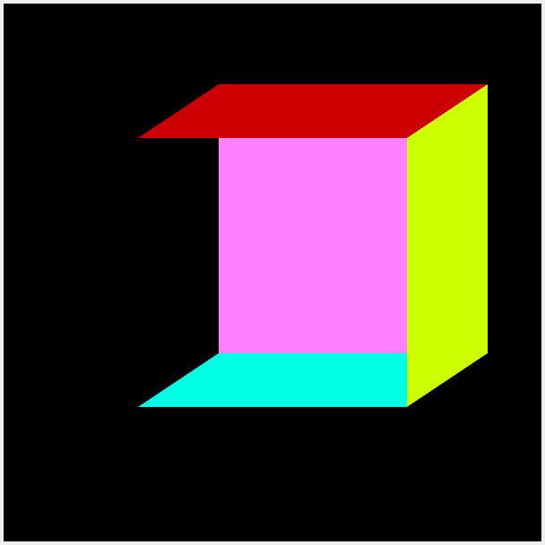

# Tugas3-Grafkom-WebGL

## The RGB Triangle to Rectangel in WebGL
untuk file yang di edit untuk menghasilkan persegi pada bentuk awal segitiga adalah pada program berikut :

```js
function draw() {
        gl.clearColor(0, 0, 0, 1); // specify the color to be used for clearing
        gl.clear(gl.COLOR_BUFFER_BIT); // clear the canvas (to black)

        /* SEGITIGA KE-1 */
        /* Set up values for the "coordsTriangle1" attribute */

        let coordsTriangle1 = new Float32Array([-0.5, -0.5, 0.5, 0.5, -0.5, 0.5]);

        gl.bindBuffer(gl.ARRAY_BUFFER, bufferCoords);
        gl.bufferData(gl.ARRAY_BUFFER, coordsTriangle1, gl.STREAM_DRAW);
        gl.vertexAttribPointer(attributeCoords, 2, gl.FLOAT, false, 0, 0);
        gl.enableVertexAttribArray(attributeCoords);

        /* Set up values for the "colorTriangle2" attribute */

        let colorTriangle1 = new Float32Array([0, 1, 0, 1, 0, 0, 0, 0, 1]);

        gl.bindBuffer(gl.ARRAY_BUFFER, bufferColor);
        gl.bufferData(gl.ARRAY_BUFFER, colorTriangle1, gl.STREAM_DRAW);
        gl.vertexAttribPointer(attributeColor, 3, gl.FLOAT, false, 0, 0);
        gl.enableVertexAttribArray(attributeColor);

        /* Draw the first triangle. */

        gl.drawArrays(gl.TRIANGLES, 0, 3);

        /* SEGITIGA KE-2 */
        /* Set up values for the "coordsTriangle2" attribute */

        let coordsTriangle2 = new Float32Array([-0.5, -0.5, 0.5, 0.5, 0.5, -0.5]);

        gl.bindBuffer(gl.ARRAY_BUFFER, bufferCoords);
        gl.bufferData(gl.ARRAY_BUFFER, coordsTriangle2, gl.STREAM_DRAW);
        gl.vertexAttribPointer(attributeCoords, 2, gl.FLOAT, false, 0, 0);
        gl.enableVertexAttribArray(attributeCoords);

        /* Set up values for the "colorTriangle2" attribute */

        let colorTriangle2 = new Float32Array([0, 1, 0, 1, 0, 0, 1, 1, 1]);

        gl.bindBuffer(gl.ARRAY_BUFFER, bufferColor);
        gl.bufferData(gl.ARRAY_BUFFER, colorTriangle2, gl.STREAM_DRAW);
        gl.vertexAttribPointer(attributeColor, 3, gl.FLOAT, false, 0, 0);
        gl.enableVertexAttribArray(attributeColor);

        /* Draw the second triangle. */

        gl.drawArrays(gl.TRIANGLES, 0, 3);
      }
```

dimana saya membuat 2 segitiga yang saling terhubung untuk menghasilkan persegi sempurna, berikut merupakan screenshoot hasil dari code yang sudah berjalan :
### segitiga pertama

### segitiga kedua

### persegi sempurna

---
<br>

## Kubus dibuat dengan WebGL dan glMatrix
untuk yang kedua adalah membuat perspektif agar gambar persegi menjadi kubus dengan berbeda warna, disini saya mengubah kode pada bagian koordinat dan warna :
```js
function draw()
{ 
    gl.clearColor(0,0,0,1);
    gl.clear(gl.COLOR_BUFFER_BIT | gl.DEPTH_BUFFER_BIT);
    //depan
    drawPrimitive( gl.TRIANGLE_FAN, [0,0.5,1,1], [-0.5,-0.5,-0.5, -0.5,0.5,-0.5, 0.5,0.5,-0.5, 0.5,-0.5,-0.5]); 
    //atas
    drawPrimitive( gl.TRIANGLE_FAN, [0.8,0,0,1], [0.5,0.5,-0.5, -0.5,0.5,-0.5, -0.2,0.7,0.5, 0.8, 0.7, 0.5]);
    //belakang
    drawPrimitive( gl.TRIANGLE_FAN, [1,0.5,1,1], [-0.2,-0.3,0.5, -0.2,0.7,0.5, 0.8,0.7,0.5, 0.8,-0.3,0.5]); 
    // kiri
    drawPrimitive( gl.TRIANGLE_FAN, [0,0,0.5,1], [-0.5,0.5,-0.5, -0.5,-0.5,-0.5, -0.2,-0.3,0.5, -0.2,0.7,0.5]);
    //kanan
    drawPrimitive( gl.TRIANGLE_FAN, [0.8,1,0,1], [0.5,0.5,-0.5, 0.5,-0.5,-0.5, 0.8,-0.3,0.5, 0.8,0.7,0.5]); 
    //bawah
    drawPrimitive( gl.TRIANGLE_FAN, [0,1,0.9,1], [-0.5,-0.5,-0.5, -0.2,-0.3,0.5, 0.8,-0.3,0.5, 0.5,-0.5,-0.5]); 
}
```

pada kode tersebut sudah dilakukan perubahan pada koordinat dan juga warna, sehingga membentuk perspektif kubus dengan perbedaan warna di semua sisi, berikut merupakan beberapa bukti yang menunjukkan gambar kubus dengan menghilangkan beberapa sisi sehingga terlihat sisi yang lain : 
### tanpa depan

### tanpa depan dan atas

### tanpa depan dan belakang

### tanpa depan dan samping kiri

### tanpa depan dan samping kanan

### tanpa depan dan bawah

### kubus lengkap

---